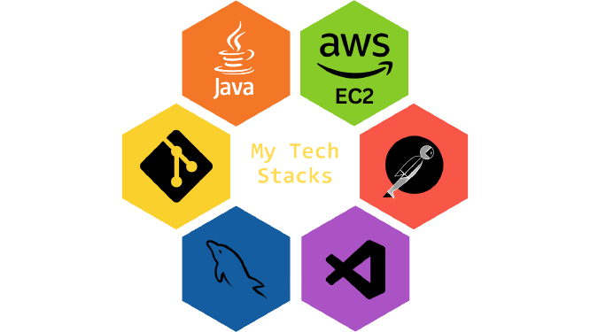

<a href="https://github.com/ankitSarwar">
  <h1 align="center">Hi 👋, I'm Ankit Sarwar</h1>

  
![][logo-url]
 

  </a>

[logo-url]: https://i.giphy.com/media/KzJkzjggfGN5Py6nkT/200.webp

  
  
   
   
  

 ### I am Ankit Sarwar, and I specialize in backend development. As a proficient backend developer experienced in Spring Boot, I possess a wealth of knowledge in Java and DSA. Currently, I am an apprentice at Geekster platform, where I am consistently enhancing my expertise in the technology field. My fervor for programming has enabled me to gain a comprehensive understanding of various programming languages, and I am perpetually enthusiastic to expand my knowledge further. I am committed, diligent, and constantly endeavoring to enhance my skills to achieve optimal outcomes.

 
 
 

## 🚀💻 Technologies & Tools

  
  
  
   
  
  
  
  

  

 
 

## ⚡ GitHub Stats

 

 
 

<h3 align="left">Connect with me:</h3>

<h3 align="left">Languages and Tools:</h3>

     </a> 

 

 

